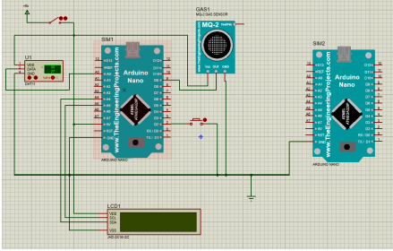

# Multi-Mode Environmental Monitoring System

## Project Overview

This project is an environmental monitoring system designed to measure and report temperature, humidity, and air quality. The system allows data transfer at different speeds ("Slow Mode", "Normal Mode", "Fast Mode") which can be toggled by an external interrupt. The system architecture utilizes various embedded programming techniques and hardware components including sensors, LCD for data display, EEPROM for data storage, and USART for data communication.

## Functionality

- **Temperature and Humidity Measurement**: Utilizes the DHT11 sensor to capture real-time temperature and humidity.
- **Air Quality Monitoring**: Air quality is gauged using an ADC to read analog signals which correlate to pollutant concentrations.
- **Data Storage**: Measurements are stored in EEPROM, enabling historical data analysis and retrieval.
- **Data Display**: Real-time sensor readings and system status are displayed on an LCD.
- **Communication**: The system sends data via USART, formatted for easy integration with external systems or logging devices.
- **Mode Switching**: System operation can be toggled between three modes affecting the frequency of readings and data transfer, using an external interrupt.

## Hardware Components

- AVR microcontroller
- DHT11 Temperature and Humidity Sensor
- EEPROM
- LCD with I2C Interface
- Push Button for Mode Switching
- LEDs indicating operational status

## Software Components

- `adc.c`: Handles ADC operations for air quality sensor readings.
- `dht.c`: Manages interactions with the DHT11 sensor.
- `eeprom.c`: Facilitates read/write operations to EEPROM.
- `i2c.c`: Manages I2C communications, primarily with the LCD.
- `lcd_i2c.c`: Functions to interact with the LCD over I2C.
- `usart.c`: Functions for USART communications for sending data externally.
- `main.c`: Contains the main logic coordinating sensor readings, data storage, and system mode management.

## Circuit Diagrams

## Usage

- The system starts in "Normal Mode" by default.
- Press the interrupt button to cycle through the modes.
- In "Slow Mode", the system updates every 2 seconds.
- In "Normal Mode", updates occur every second.
- "Fast Mode" provides updates every 500 milliseconds.
- Data is displayed on the LCD and sent over USART simultaneously.
